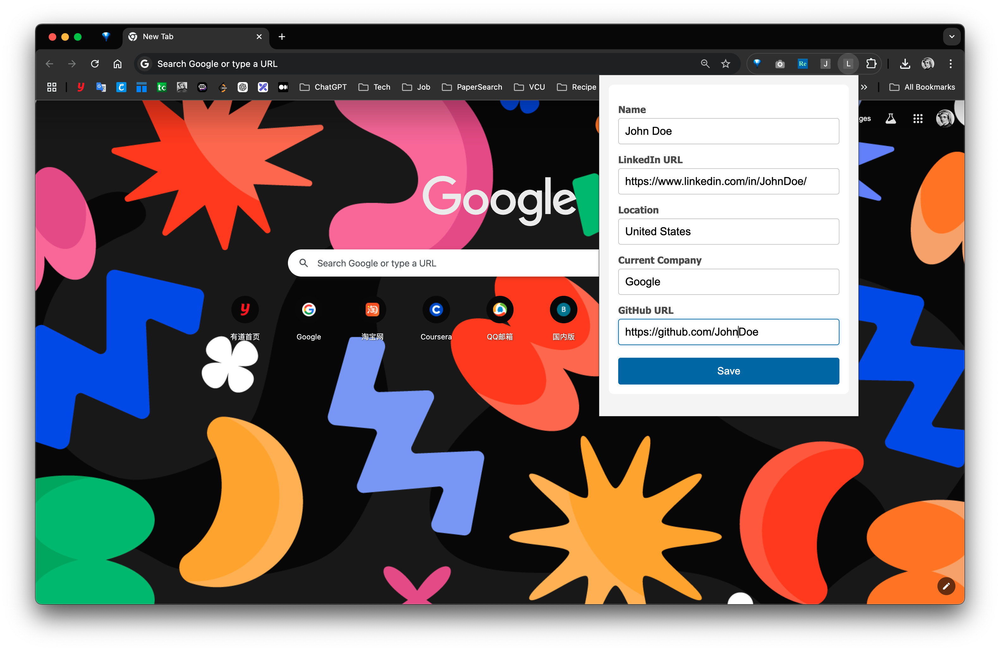

# LinkedIn Job Page Button Clicker

The LinkedIn Job Page Button Clicker is a Chrome extension designed to streamline and accelerate your job search on
LinkedIn by automating repetitive tasks and enhancing your application workflow

## 🚀 1. Getting Started

**Clone or Download the Repository**

```bash
git clone https://github.com/panoslin/LinkedinJobHotKeys.git
```

**Load the Extension into Chrome**

1. Fire up **Google Chrome**.
2. Head to [chrome://extensions/](chrome://extensions/).
3. Enable Developer mode with the switch at the top-right corner.
4. Click Load unpacked and select the folder you just cloned (LinkedinJobHotKeys).

Boom! Your extension is now ready to supercharge your job search.

## **⚡ 2. How to Use**

1. Navigate to the LinkedIn Job Search [page](https://www.linkedin.com/jobs/search).

2. Click open the extension popup and fill in your personal information.

   

3. Start using **hotkeys** to speed through job applications like a pro!

**Hotkey Magic:**

**`Ctrl + x`: Hotkey for Easy Apply & Next Step**

- Apply for the current job posting instantly.
- Click through next steps in the application process like a breeze.
- **Auto-Fill Forms**: Personal information fields are automatically filled using your details from personalInfo.json.

**`Shift + Ctrl + x`: Hotkey for Next Job Posting**

- Skip to the next job that’s NOT viewed and NOT applied for yet.
- Effortlessly turn the page to find more opportunities.
- **Auto-Download JD**: Automatically downloads the job description of the current job.

**`Ctrl + d`: Download Job Description**

- Manually download the job description of the current job posting.

**`Ctrl + z`: Locate the current Job Description**

- Locate and scroll to the current job description.

**Auto-Advance to the Next Job**

- Once you’ve completed an application, the extension automatically downloads the job description for your records and
  seamlessly moves on to the next available opportunity, keeping the momentum going!

Now, go conquer your LinkedIn job search with speed and precision! 💥